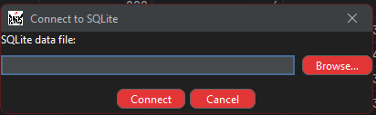
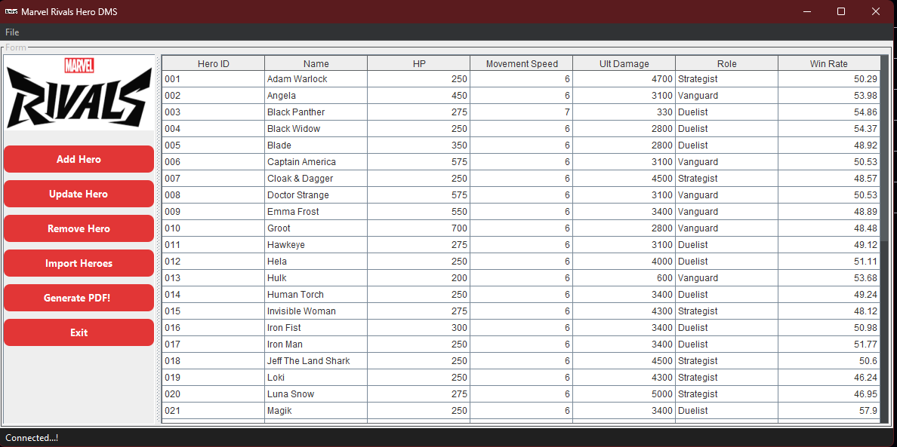
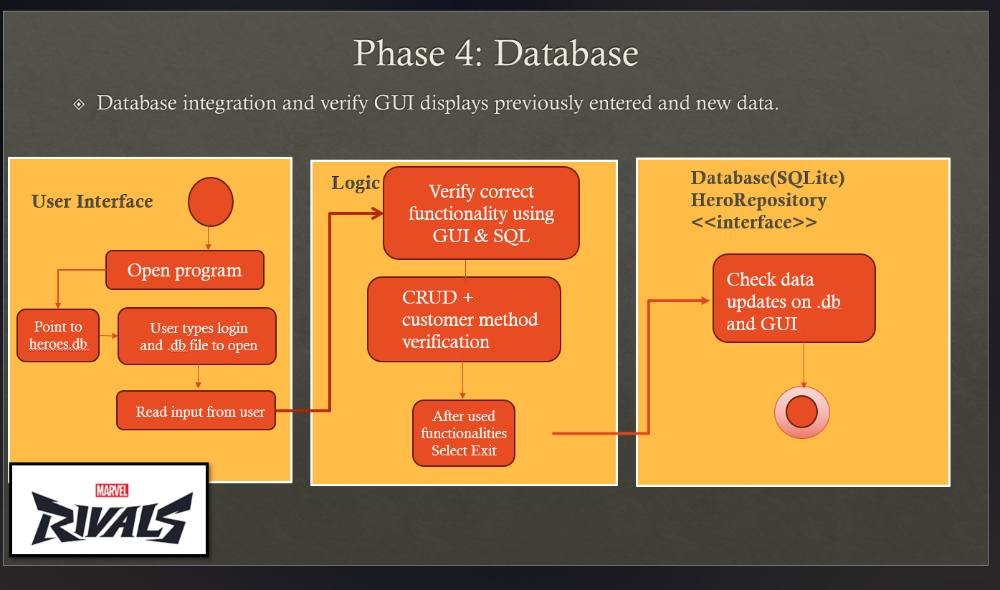

# COP-3330C-Module-10-Phase4-Marvel-Rivals-DMS
Database integration for COP-330C Marvel Rivals DMS  || Includes resources .db as sample, used MarvelRivals.com official website data

**Name:** Kenji Nakanishi 
**Course:** CEN 3024C Software Development-I 
**CRN:** 14877

**Description of the project: **

Marvel Rivals is a shooting game that is becoming very popular among PC & PS5 | PS4 gamers. I also enjoy this game so much that I wanted to create a DMS based on this game!
(Currenlty as 2025 November, Marvel Rivals has 343,000 players, and when peak time went up to 650,000. 

For Phase 4, we will start using SQlite software to use the database intregration function, and SQL helper inside IntelliJ to run Query and Console for the database. 
This phase includes the GUI created previously and not longer use the console based interface. So, it runs purely on database + GUI. 

This GUI Marvek Rivals app has the following architecture: 
src/main/java where we have:

main 

**MainFrame.java** 
Where all the interface is programmed for the GUI! 

-> Prompt user to look for the .db file in his PC! 

**JdbcHeroRepository.java**   

Implemented interface HeroRepository that handled logic & database INSERT INTO actions for:
- save
- findById
- findAll
- update
- deleteById
- existsById

**Database.java** 

Charge of the connections between database and GUI; safe opening and closing

Here is the reference information from the Phase 1 and 2 where we set how the test will work and created the UML diagram. 

**heroes.db** 

This time we included the heroes.db for sample data, no longer csv or text file! 

This is an example of the GUI where the user can import a csv file,
We can see the user loaded a hero season 1 file where the records has been passed through all the fields! 

**Tools used:**
- SQLite
- SQL Helper plugin
- Java language
- IDE: JetBrain IntelliJ IDE
- Libraries: FlatLaf 3.5
- iTextPDF 5.5
- Maven
- Canva
